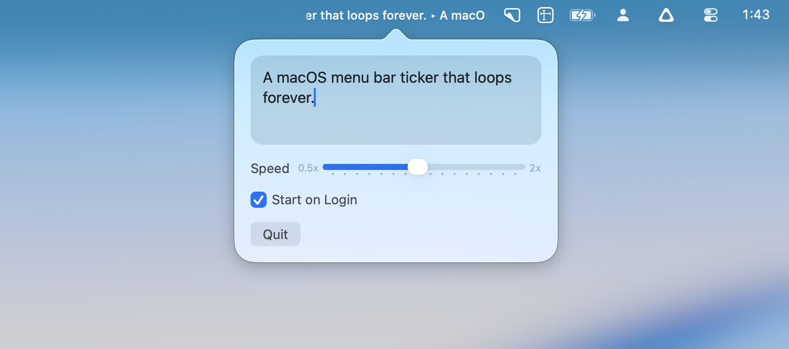

# menubar-ticker

> A macOS menu bar ticker that loops a custom sentence forever.



## Setup

Open the checked-in Xcode project:

```sh
open menubar-ticker.xcodeproj
```

This repo uses the `.xcodeproj` as the source of truth. The app icon is driven directly by [`app/icon.icon`](app/icon.icon).

## Build

```sh
xcodebuild -project menubar-ticker.xcodeproj -scheme MenubarTicker -destination 'platform=macOS' build
```

The shared project builds unsigned by default. The install and release scripts sign the finished app with a local Apple Development certificate.

## Test

```sh
xcodebuild -project menubar-ticker.xcodeproj -scheme MenubarTicker -destination 'platform=macOS' test
```

## Install

Build, sign with a local Apple Development certificate, replace the app in `/Applications`, and relaunch it. Set `TEAM_ID` if you need to pick a specific team:

```sh
./scripts/install-app.sh
```

## Release

Create a signed `Release` build plus a zip in `dist/`:

```sh
./scripts/release-app.sh
```

Current outputs:

```text
dist/MenubarTicker.app
dist/MenubarTicker-<version>-<build>.zip
```

This release path uses a local Apple Development certificate. It is not a notarized Developer ID distribution flow.

## Notes

- The app runs as an `LSUIElement` menu bar app.
- The ticker text and speed are persisted in `UserDefaults`.
- `Start on Login` uses `SMAppService.mainApp`.
